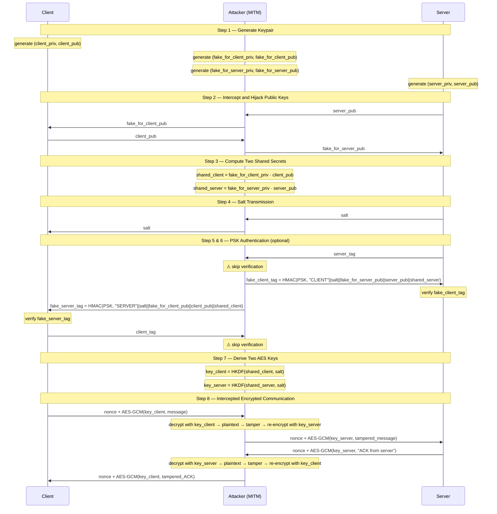

# Diffie-Hellman MITM Attack Demo (Python)
- This project demonstrates a practical Man-in-the-Middle (MITM) attack on the Diffie-Hellman (DH) key exchange protocol using ARP spoofing in a 3-VM isolated lab environment.
- The implementation includes 4 scenarios:
    - Normal DH key exchange
    - MITM attack without authentication
    - MITM prevented by PSK authentication
    - MITM successful with leaked PSK

## 1. Diffie-Hellman Key Exchange
- This project implements an authenticated key exchange based on X25519 (Elliptic Curve Diffie-Hellman).
- During the handshake, both parties exchange public keys and compute a shared secret:
    - shared = priv_A * pub_B = priv_B * pub_A
- The shared secret is then processed through HKDF-SHA256 to derive a 256-bit AES symmetric key for authenticated encryption.
- Optional PSK-based authentication is implemented using HMAC-SHA256 to bind the handshake parameters and prevent MITM attacks.

## 2. MITM Attack
- Diffie-Hellman alone does not provide authentication.
- The attacker can:
    - Perform ARP spoofing to intercept traffic
    - Replace public keys during handshake
    - Establish two independent shared secrets:
        - Client ↔ Attacker
        - Attacker ↔ Server
    - Transparently decrypt, modify, and re-encrypt messages
- The attacker then acts as a transparent bidirectional TCP proxy, stripping the encryption of one session and re-encrypting it for the other.

## 3. PSK-based Authentication Defense
- To mitigate MITM attacks, a Pre-Shared Key (PSK) is introduced.
- The authentication tag is computed as:
    - HMAC(key = PSK, role || salt || pub_self || pub_peer || shared_secret)
- If the attacker does not possess the correct PSK:
    - Authentication fails
    - The connection is terminated
- If the PSK is leaked:
    - The attacker can successfully authenticate both sides
    - MITM becomes possible again

## 4. Lab Environment
- 3 Virtual Machines under "Internal Network" mode.
    - Client (192.168.1.10)
    - Server (192.168.1.20)
    - Attacker (192.168.1.30)
- ARP spoofing for traffic interception
- Isolated network for safety

## 5. How to Run
- Install dependencies
    - pip install cryptography
- Scenario 1: Normal DH
    - python server.py
    - python client.py
- Scenario 2–4: MITM
    - python server.py
    - python attacker.py
    - python client.py
- Scenario 3 (Defense): Attacker uses false PSK -> Authentication fails.
- Scenario 4 (Leaked): Attacker uses true PSK -> MITM succeeds.

- Follow the prompts to enable/disable PSK authentication
- Important: The PSK authentication setting must be consistent across all parties.

## 6. Educational Purpose
**This project is intended for educational and research purposes only.**

## 7. License
- MIT License
