# Diffie-Hellman MITM Attack Demo (Python)
- This project demonstrates a practical Man-in-the-Middle (MITM) attack on the Diffie-Hellman (DH) key exchange protocol using ARP spoofing in a 3-VM isolated lab environment.
- The implementation includes 4 scenarios:
    - (1) Normal DH key exchange
    - (2) MITM attack without authentication
    - (3) MITM prevented by PSK authentication
    - (4) MITM successful with leaked PSK

## 🎥 Executive Demo (2m46s)

[](https://youtu.be/oz47gJUolfw)

### Timeline

00:00 Normal DH key exchange  
00:12 ARP cache poisoning  
00:28 Active MITM without authentication  
01:02 PSK authentication prevents MITM  
01:21 MITM success with leaked PSK  
01:52 Multi-client concurrency demo  

## Project Structure
```text
├── src/
│   ├── client.py        # ECDH Client logic (initiator)
│   ├── server.py        # Multi-threaded ECDH Server
│   ├── attacker.py      # MITM Proxy & Interactive Console
│   ├── crypto_utils.py  # X25519, AES-GCM, HMAC, HKDF logic
│   └── network_utils.py # Length-prefixed framing & socket helpers
├── image/
│   ├── attacker-arpspoof-client.png
│   ├── attacker_tampering.png
│   ├── client-arp-poisoned.png
│   ├── client-auth-failed.png
│   └── server-auth-failed.png
├── README.md            # Documentation
└── LICENSE              # MIT License
```
## 1. Diffie-Hellman Key Exchange
- This project implements an authenticated key exchange based on X25519 (Elliptic Curve Diffie-Hellman).
- During the handshake, both parties exchange public keys and compute a shared secret:
    - shared = priv_A * pub_B = priv_B * pub_A
- The shared secret is then processed through HKDF-SHA256 to derive a 256-bit AES symmetric key for authenticated encryption.
- Optional PSK-based authentication is implemented using HMAC-SHA256 to bind the handshake parameters and prevent MITM attacks.


## 2. MITM Attack
**2.1 ARP Cache Poisoning (Traffic Interception)**
- ARP (Address Resolution Protocol) is used to map IP addresses to MAC addresses within a LAN.
- Since ARP does not provide authentication, any host can send forged ARP replies.
- The attacker exploits this weakness by sending unsolicited ARP replies, causing the victim to associate the server's IP address with the attacker's MAC address.
- As a result, traffic intended for the server is redirected to the attacker.


(Attacker MAC: 08:00:27:1d:69:25)

**2.2 Active MITM on DH Handshake**
- Diffie-Hellman alone does not provide authentication.
- The attacker can:
    - Perform ARP spoofing to intercept traffic
    - Replace public keys during handshake
    - Establish two independent shared secrets:
        - Client ↔ Attacker
        - Attacker ↔ Server
    - Transparently decrypt, modify, and re-encrypt messages
- The attacker then acts as a transparent bidirectional TCP proxy, stripping the encryption of one session and re-encrypting it for the other.

```mermaid
sequenceDiagram
    participant C as Client
    participant M as Attacker (MITM)
    participant S as Server

    Note over C,S: Step 1 — Generate Keypair
    Note over C: generate (client_priv, client_pub)
    Note over S: generate (server_priv, server_pub)
    Note over M: generate (fake_for_client_priv, fake_for_client_pub)
    Note over M: generate (fake_for_server_priv, fake_for_server_pub)
    
    Note over C,S: Step 2 — Intercept and Hijack Public Keys
    S->>M: server_pub
    M->>C: fake_for_client_pub<br/>(impersonate as server's public key)
    C->>M: client_pub
    M->>S: fake_for_server_pub<br/>(impersonate as client's public key)

    Note over C,S: Step 3 — Compute Two Shared Secrets
    Note over C: shared = client_priv · fake_for_client_pub
    Note over S: shared = server_priv · fake_for_server_pub
    Note over M: shared_client = fake_for_client_priv · client_pub
    Note over M: shared_server = fake_for_server_priv · server_pub

    Note over C,S: Step 4 — Salt Transmission
    S->>M: salt
    M->>C: salt

    Note over C,S: Step 5 and 6 — PSK Authentication (optional)
    S->>M: server_tag
    Note over M: ⚠ skip verification
    M->>S: fake_client_tag = HMAC(PSK, <br/>"CLIENT"||salt||fake_for_server_pub<br/>||server_pub||shared_server)
    Note over S: verify fake_client_tag
    M->>C: fake_server_tag = HMAC(PSK, <br/>"SERVER"||salt||fake_for_client_pub<br/>||client_pub||shared_client)
    Note over C: verify fake_server_tag
    C->>M: client_tag
    Note over M: ⚠ skip verification

    Note over C,S: Step 7 — Derive Two AES Keys
    Note over M: key_client = HKDF(shared_client, salt)
    Note over M: key_server = HKDF(shared_server, salt)

    Note over C,S: Step 8 — Intercepted Encrypted Communication
    C->>M: nonce + AES-GCM(key_client, message)
    Note over M: decrypt with key_client → plaintext → tamper → re-encrypt with key_server
    M->>S: nonce + AES-GCM<br/>(key_server, tampered_message)
    S->>M: nonce + AES-GCM<br/>(key_server, "ACK from server")
    Note over M: decrypt with key_server → plaintext → tamper → re-encrypt with key_client
    M->>C: nonce + AES-GCM(key_client, tampered_ACK)
```
  


## 3. PSK-based Authentication Defense
- To mitigate MITM attacks, a Pre-Shared Key (PSK) is introduced.
- The authentication tag is computed as:
    - HMAC(key = PSK, role || salt || my_pub || peer_pub || shared_secret)
- If the attacker does not possess the correct PSK:
    - Authentication fails
    - The connection is terminated


- If the PSK is leaked:
    - The attacker can successfully authenticate both sides
    - MITM becomes possible again

## 4. Technical Highlights
- **Concurrent Session Isolation**: Both the Server and Attacker utilize a multi-threaded architecture. Each session maintains its own isolated cryptographic state (independent keys and AES contexts), ensuring no cross-contamination between concurrent client connections.
- **Centralized Inter-Thread Interception**: The Attacker employs a producer-consumer pattern via `queue.Queue`. While cryptographic operations remain thread-local, intercepted messages are piped to a centralized Interactive Console Manager. This design effectively decouples high-speed network I/O from slow human-in-the-loop interactions without compromising session integrity.
- **Thread-Safe Console Output**: A global RLock is used to serialize all print and input operations across concurrent session threads. The Interactive Console Manager acquires the lock for the entire prompt-input cycle, preventing output interleaving and ensuring coherent console interaction during multi-session hijacking.

## 5. Lab Environment
- 3 Virtual Machines under "Internal Network" mode.
    - Client (192.168.1.10)
    - Server (192.168.1.20)
    - Attacker (192.168.1.30)
- ARP spoofing for traffic interception
- Isolated network for safety

```mermaid
graph TD
    subgraph Internal Network 192.168.1.0/24
        C["🖥 Client<br/>192.168.1.10"]
        S["🖥 Server<br/>192.168.1.20:50000"]
        M["🖥 Attacker<br/>192.168.1.30:50000"]
    end

    C <-- "TCP Communication" --> M
    M <-- "TCP Communication" --> S
    M -. "ARP spoofing<br/>poison Client's ARP table" .-> C
    M -. "ARP spoofing<br/>poison Server's ARP table" .-> S
```

## 6. How to Run
- **Install dependencies**: `pip install cryptography`
- **Execution Order**: 
    - For Scenario 1, start `server.py` first, then client.py.
    - For Scenarios 2–4, ensure `attacker.py` and `server.py` are running before launching `client.py` (the order between Attacker and Server does not matter).
- **Interactive Configuration**:
    - Note on Protocol Synchronization: The PSK authentication toggle (y/n) must be identical across the Client, Server, and Attacker. If one party expects a PSK tag while another doesn't, the handshake state machine will desynchronize and fail.
    - Scenario 1: Toggle PSK mode (y/n) identically on both. Communication succeeds.
    - Scenario 2: Disable PSK mode on all. MITM succeeds via public key replacement.
    - Scenario 3: Enable PSK mode on all. When `attacker.py` prompts for true PSK access, choose 'n' (False PSK). The Attacker cannot forge the tag; authentication fails at the endpoints.
    - Scenario 4: Enable PSK mode on all. When `attacker.py` prompts for true PSK access, choose 'y' (True PSK). The Attacker can now forge valid tags for both sides; MITM succeeds.

## 7. Educational Purpose
- This project is developed **strictly for educational and research purposes** to demonstrate cryptographic vulnerabilities and their respective mitigations
    - **Ethical Use**: This tool should only be used in **isolated, authorized** lab environments for learning network security concepts.
    - **Disclaimer**: The author is not responsible for any misuse of this software. Unauthorized interception or tampering of network traffic is illegal and violates professional codes of conduct.

## 8. License
- MIT License
